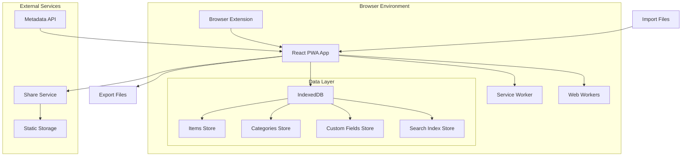
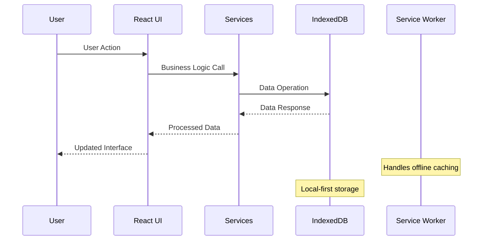

# Design Document

## Overview

The Novel & Comic Collector (NCC) is designed as a client-centric, offline-first application that prioritizes user privacy and data ownership. The architecture follows a progressive enhancement approach where the core functionality works entirely offline, with optional online features for sharing and metadata enrichment.

The system employs a layered architecture with clear separation of concerns:
- **Presentation Layer**: React components with TypeScript
- **Business Logic Layer**: Custom hooks and services
- **Data Access Layer**: Dexie.js wrapper around IndexedDB
- **Storage Layer**: Browser's IndexedDB for local persistence

## Architecture

### System Architecture

The application follows a client-centric architecture where the browser serves as the primary runtime environment:



### Data Flow Architecture



## Components and Interfaces

### Core Components Architecture

#### 1. Data Management Components

**ItemManager Component**
- Handles CRUD operations for collection items
- Manages item validation and data integrity
- Coordinates with search indexing service
- Supports batch operations with progress tracking

**CategoryManager Component**
- Manages hierarchical category structure
- Handles drag-and-drop reordering
- Maintains category statistics and relationships
- Supports unlimited nesting levels

**CustomFieldManager Component**
- Manages dynamic field definitions
- Handles field validation and type conversion
- Supports template-based field creation
- Manages field privacy settings

#### 2. Search and Discovery Components

**SearchEngine Component**
- Implements full-text search using Lunr.js or similar
- Manages search indexing in Web Workers
- Provides real-time search suggestions
- Handles complex filtering logic

**FilterPanel Component**
- Provides multi-dimensional filtering interface
- Manages filter state and persistence
- Supports saved filter presets
- Handles filter combination logic

#### 3. Import/Export Components

**ImportWizard Component**
- Multi-step import process with validation
- Field mapping interface for CSV imports
- Deduplication strategy selection
- Progress tracking and error reporting

**ExportManager Component**
- Multiple format export support
- Selective data export options
- Privacy-aware field filtering
- Batch export with compression

#### 4. Sharing Components

**ShareBuilder Component**
- Share page configuration interface
- Privacy field selection
- Custom styling options
- Preview functionality

**ShareRenderer Component**
- Static HTML generation for share pages
- Responsive layout rendering
- Offline-capable share pages
- SEO-friendly markup

### Service Layer Interfaces

#### Database Service Interface

```typescript
interface DatabaseService {
  // Item operations
  createItem(item: Omit<Item, 'id' | 'createdAt' | 'updatedAt'>): Promise<Item>;
  updateItem(id: string, updates: Partial<Item>): Promise<Item>;
  deleteItem(id: string): Promise<void>;
  getItem(id: string): Promise<Item | null>;
  getItems(options?: QueryOptions): Promise<Item[]>;
  
  // Category operations
  createCategory(category: Omit<Category, 'id'>): Promise<Category>;
  updateCategory(id: string, updates: Partial<Category>): Promise<Category>;
  deleteCategory(id: string): Promise<void>;
  getCategories(): Promise<Category[]>;
  getCategoryTree(): Promise<CategoryNode[]>;
  
  // Custom field operations
  createCustomField(field: Omit<CustomField, 'id'>): Promise<CustomField>;
  updateCustomField(id: string, updates: Partial<CustomField>): Promise<CustomField>;
  deleteCustomField(id: string): Promise<void>;
  getCustomFields(): Promise<CustomField[]>;
  
  // Batch operations
  batchCreateItems(items: Omit<Item, 'id' | 'createdAt' | 'updatedAt'>[]): Promise<Item[]>;
  batchUpdateItems(updates: Array<{id: string, updates: Partial<Item>}>): Promise<Item[]>;
  batchDeleteItems(ids: string[]): Promise<void>;
}
```

#### Search Service Interface

```typescript
interface SearchService {
  indexItem(item: Item): Promise<void>;
  removeFromIndex(itemId: string): Promise<void>;
  search(query: string, options?: SearchOptions): Promise<SearchResult[]>;
  suggest(query: string, limit?: number): Promise<string[]>;
  rebuildIndex(): Promise<void>;
}

interface SearchOptions {
  categories?: string[];
  tags?: string[];
  customFields?: Record<string, any>;
  dateRange?: DateRange;
  sortBy?: string;
  sortOrder?: 'asc' | 'desc';
  limit?: number;
  offset?: number;
}
```

#### Import/Export Service Interface

```typescript
interface ImportExportService {
  // Import operations
  detectFormat(file: File): Promise<ImportFormat>;
  validateImportData(data: any, format: ImportFormat): Promise<ValidationResult>;
  mapFields(data: any, mapping: FieldMapping): Promise<Item[]>;
  importItems(items: Item[], strategy: DeduplicationStrategy): Promise<ImportResult>;
  
  // Export operations
  exportToJSON(options: ExportOptions): Promise<Blob>;
  exportToCSV(options: ExportOptions): Promise<Blob>;
  exportToBookmarks(options: ExportOptions): Promise<Blob>;
}
```

## Data Models

### Enhanced Data Models with Relationships

#### Item Model with Computed Properties

```typescript
interface Item {
  // Core properties
  id: string;
  title: string;
  url?: string;
  coverUrl?: string;
  description?: string;
  
  // Organization
  categoryPath: string[];
  tags: string[];
  customFields: Record<string, any>;
  
  // Metadata
  createdAt: Date;
  updatedAt: Date;
  isPrivate: boolean;
  
  // Computed properties (not stored)
  categoryNames?: string[];
  tagObjects?: Tag[];
  searchableContent?: string;
}
```

#### Category Model with Tree Structure

```typescript
interface Category {
  id: string;
  name: string;
  parentId?: string;
  description?: string;
  icon?: string;
  color?: string;
  order: number;
  
  // Computed properties
  children?: Category[];
  level?: number;
  fullPath?: string[];
  itemCount?: number;
}

interface CategoryNode extends Category {
  children: CategoryNode[];
  isExpanded: boolean;
}
```

#### Custom Field Model with Validation

```typescript
interface CustomField {
  id: string;
  name: string;
  type: FieldType;
  isPrivate: boolean;
  isRequired: boolean;
  
  // Type-specific options
  options?: string[];        // For select type
  defaultValue?: any;
  validation?: FieldValidation;
  
  // Display options
  displayOrder: number;
  isCollapsible: boolean;
  helpText?: string;
}

interface FieldValidation {
  min?: number;
  max?: number;
  pattern?: string;
  customValidator?: string;  // JavaScript function as string
}

type FieldType = 'text' | 'number' | 'url' | 'date' | 'select' | 'boolean' | 'textarea' | 'rating' | 'multiselect' | 'file';
```

### State Management Models

#### Application State Structure

```typescript
interface AppState {
  // Data state
  items: Record<string, Item>;
  categories: Record<string, Category>;
  customFields: Record<string, CustomField>;
  tags: Record<string, Tag>;
  
  // UI state
  ui: {
    selectedItems: string[];
    currentView: ViewMode;
    collapsedPanels: Record<string, boolean>;
    filterState: FilterState;
    searchState: SearchState;
  };
  
  // Operation state
  operations: {
    isLoading: boolean;
    currentOperation?: OperationType;
    progress?: ProgressState;
    history: HistoryEntry[];
  };
  
  // Settings
  settings: {
    language: Language;
    theme: Theme;
    defaultTemplate: TemplateType;
    privacySettings: PrivacySettings;
  };
}
```

## Error Handling

### Error Classification and Handling Strategy

#### 1. Data Layer Errors

**Database Errors**
- Connection failures: Retry with exponential backoff
- Storage quota exceeded: Prompt user for cleanup options
- Data corruption: Attempt recovery from history, fallback to backup
- Schema migration errors: Rollback to previous version

**Validation Errors**
- Field validation failures: Show inline error messages
- Required field missing: Highlight missing fields
- Data type mismatches: Attempt type coercion, show warning
- Constraint violations: Provide correction suggestions

#### 2. Business Logic Errors

**Import/Export Errors**
- File format not supported: Show supported formats
- Parsing errors: Provide detailed error location
- Deduplication conflicts: Present resolution options
- Large file processing: Implement chunked processing

**Search Errors**
- Index corruption: Rebuild index automatically
- Query syntax errors: Provide query suggestions
- Performance issues: Implement query optimization

#### 3. Network Errors

**Metadata Fetching Errors**
- Network unavailable: Cache requests for later retry
- Invalid URLs: Validate and sanitize URLs
- Parsing failures: Fallback to manual entry
- Rate limiting: Implement request queuing

**Sharing Service Errors**
- Upload failures: Retry with exponential backoff
- Authentication errors: Refresh tokens automatically
- Service unavailable: Show offline mode options

### Error Recovery Mechanisms

```typescript
interface ErrorHandler {
  handleDatabaseError(error: DatabaseError): Promise<void>;
  handleValidationError(error: ValidationError): ValidationResult;
  handleNetworkError(error: NetworkError): Promise<void>;
  handleUnknownError(error: Error): void;
}

interface RecoveryStrategy {
  canRecover(error: Error): boolean;
  recover(error: Error): Promise<boolean>;
  fallback(error: Error): void;
}
```

## Testing Strategy

### Testing Pyramid Approach

#### 1. Unit Tests (70%)

**Component Testing**
- React component rendering and behavior
- Custom hooks functionality
- Utility function correctness
- Data model validation

**Service Testing**
- Database operations with mock IndexedDB
- Search functionality with test datasets
- Import/export logic with sample files
- Error handling scenarios

#### 2. Integration Tests (20%)

**Data Flow Testing**
- End-to-end data operations
- Component interaction testing
- Service integration testing
- Browser API integration

**PWA Testing**
- Service worker functionality
- Offline behavior testing
- Installation and update flows
- Performance benchmarking

#### 3. End-to-End Tests (10%)

**User Journey Testing**
- Complete user workflows
- Cross-browser compatibility
- Mobile responsiveness
- Accessibility compliance

**Performance Testing**
- Large dataset handling
- Search performance benchmarks
- Memory usage optimization
- Battery usage on mobile

### Testing Infrastructure

```typescript
// Test utilities and mocks
interface TestUtils {
  createMockDatabase(): MockDatabase;
  generateTestData(count: number): Item[];
  mockIndexedDB(): void;
  mockServiceWorker(): void;
}

// Performance testing
interface PerformanceTest {
  measureSearchTime(query: string, datasetSize: number): Promise<number>;
  measureImportTime(fileSize: number): Promise<number>;
  measureMemoryUsage(): Promise<MemoryInfo>;
}
```

### Quality Assurance Checklist

- [ ] All components have unit tests with >90% coverage
- [ ] Integration tests cover critical user paths
- [ ] Performance tests validate requirements (search <500ms, load <3s)
- [ ] Accessibility tests ensure WCAG 2.1 AA compliance
- [ ] Cross-browser testing on Chrome 88+, Firefox 78+, Safari 14+
- [ ] Mobile responsiveness testing on various screen sizes
- [ ] Offline functionality testing in all scenarios
- [ ] Data integrity testing with large datasets
- [ ] Security testing for XSS and data validation
- [ ] Internationalization testing for supported languages

This design provides a comprehensive foundation for implementing the Novel & Comic Collector application with proper separation of concerns, robust error handling, and thorough testing coverage.