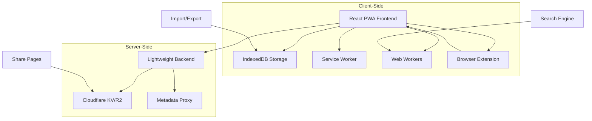

# Requirements Document

## Introduction

The Novel & Comic Collector (NCC) is an offline-first personal collection management tool designed for book and comic enthusiasts. The application provides a privacy-focused, PWA-based solution that allows users to catalog, organize, and share their collections while maintaining full offline functionality. The system emphasizes user privacy with local-first data storage, flexible organization through custom fields and categories, and optional sharing capabilities with customizable public collection pages.

## Technical Context

### Core Technology Stack
- **Frontend**: React PWA with TypeScript
- **Data Storage**: IndexedDB with Dexie.js
- **Backend**: Lightweight service (Cloudflare Workers/Vercel Edge Functions)
- **Extension**: Optional browser extension for quick collection

### Data Model Interfaces

```typescript
interface Item {
  id: string;              // UUID
  title: string;           // Required
  url?: string;            // Unique constraint
  coverUrl?: string;
  description?: string;
  categoryPath: string[];  // Multi-level category path
  tags: string[];          // Tag array
  customFields: Record<string, any>; // Custom field values
  createdAt: Date;
  updatedAt: Date;
  isPrivate: boolean;      // Item privacy
}

interface CustomField {
  id: string;
  name: string;
  type: 'text' | 'number' | 'url' | 'date' | 'select' | 'boolean' | 'textarea' | 'rating';
  isPrivate: boolean;      // Field privacy
  isRequired: boolean;
  options?: string[];      // Options for select type
  defaultValue?: any;
  validation?: {
    min?: number;
    max?: number;
    pattern?: string;
  };
}

interface Category {
  id: string;
  name: string;
  parentId?: string;       // Support unlimited levels
  description?: string;
  icon?: string;
  color?: string;
  order: number;           // Sort order
}

interface ShareCollection {
  id: string;
  title: string;
  description?: string;
  items: Item[];           // Items with public fields only
  settings: {
    coverImage?: string;
    backgroundColor?: string;
    textColor?: string;
    layout: 'list' | 'grid' | 'card';
    expiresAt?: Date;
    allowedFields: string[]; // Whitelisted fields
  };
  createdAt: Date;
}

interface DeduplicationStrategy {
  urlExact: boolean;       // Exact URL matching
  titleSimilarity: number; // Title similarity threshold (0-1)
  customFieldMatching: string[]; // Specified field matching
  action: 'skip' | 'merge' | 'duplicate' | 'ask'; // Action when duplicates found
}
```

### Database Schema Design

```typescript
// IndexedDB stores using Dexie.js
const dbSchema = {
  items: '++id, title, url, &url, categoryPath, tags, createdAt, updatedAt',
  categories: '++id, name, parentId, order',
  customFields: '++id, name, type, isPrivate',
  tags: '++id, name, color, usageCount',
  history: '++id, timestamp, type, affectedItemIds',
  searchIndex: '++id, itemId, content',
  shareCollections: '++id, title, createdAt'
};
```

### API Endpoints Specification

```typescript
// Backend API endpoints
GET  /api/fetch-meta?url=xxx    // Proxy metadata fetching
POST /api/sign-upload           // Get upload signature
POST /api/publish-share         // Publish share page
GET  /api/share/:token          // Access share page
POST /api/revoke-share/:token   // Revoke share
GET  /api/health                // Health check
```

### Project Structure

```
src/
├── components/          # Reusable components
│   ├── ui/             # Basic UI components
│   ├── forms/          # Form components
│   ├── search/         # Search-related components
│   └── share/          # Share-related components
├── pages/              # Page components
├── hooks/              # Custom Hooks
├── services/           # Business logic layer
│   ├── database.ts     # IndexedDB operations
│   ├── search.ts       # Full-text search
│   ├── import.ts       # Import logic
│   ├── share.ts        # Share logic
│   └── sync.ts         # Sync logic
├── utils/              # Utility functions
└── workers/            # Web Workers

extension/              # Browser extension (optional)
├── manifest.json       # Extension configuration
├── content-script.js   # Page-injected script
├── background.js       # Background script
├── popup/              # Popup interface
│   ├── popup.html
│   ├── popup.js
│   └── popup.css
└── icons/              # Icon resources
```

### Architecture Overview



### Priority Classification (MoSCoW Method)

**MUST HAVE (Phase 1 - MVP)**
- Basic CRUD operations for items
- Category management with hierarchical structure
- Local data storage with IndexedDB
- Basic search and filtering
- JSON import/export
- PWA installation and offline functionality

**SHOULD HAVE (Phase 2 - Enhanced Features)**
- Custom field system with templates
- Full-text search engine
- Operation history and undo
- URL metadata auto-parsing
- Batch operations
- Advanced filtering options

**COULD HAVE (Phase 3 - Advanced Features)**
- Collection sharing system
- Browser extension
- Multiple view modes (list/grid/card)
- Keyboard shortcuts
- Collapsible UI panels
- Multi-language support (Traditional Chinese/English)

**WON'T HAVE (Explicitly Excluded)**
- Social features (forums/chat)
- Native mobile apps
- User following systems
- Public collection indexing

## Requirements

### Requirement 1: Item Collection Management

**User Story:** As a collector, I want to add, edit, and organize my books and comics in a personal database, so that I can maintain a comprehensive catalog of my collection.

#### Acceptance Criteria

1. WHEN a user creates a new item THEN the system SHALL require a title and allow optional fields including URL, cover image, description, category path, tags, and custom fields
2. WHEN a user provides a URL for an item THEN the system SHALL enforce uniqueness constraints to prevent duplicates
3. WHEN a user updates an item THEN the system SHALL track the modification timestamp and maintain data integrity
4. WHEN a user deletes an item THEN the system SHALL support soft deletion with recovery options
5. WHEN a user performs bulk operations THEN the system SHALL support batch creation, editing, and deletion of multiple items

### Requirement 2: Flexible Organization System

**User Story:** As a collector, I want to organize my items using categories, tags, and custom fields, so that I can structure my collection according to my personal preferences.

#### Acceptance Criteria

1. WHEN a user creates categories THEN the system SHALL support unlimited hierarchical levels with drag-and-drop reordering
2. WHEN a user assigns categories THEN the system SHALL store the full category path and display item counts per category
3. WHEN a user creates custom fields THEN the system SHALL support multiple field types including text, number, URL, date, select, boolean, textarea, and rating
4. WHEN a user defines custom fields THEN the system SHALL allow privacy settings, required field validation, and default values
5. WHEN a user applies tags THEN the system SHALL support multiple tags per item with auto-completion and usage statistics

### Requirement 3: Offline-First Data Storage

**User Story:** As a user, I want my collection data to be stored locally and work completely offline, so that I can access and manage my collection without internet connectivity.

#### Acceptance Criteria

1. WHEN the application loads THEN the system SHALL store all data in IndexedDB for offline access
2. WHEN the user is offline THEN the system SHALL provide full CRUD functionality without internet connectivity
3. WHEN data is modified offline THEN the system SHALL maintain data consistency and integrity
4. WHEN the application is installed as a PWA THEN the system SHALL provide native app-like experience with offline capabilities
5. WHEN private fields are used THEN the system SHALL optionally support client-side E2E encryption using AES-256

### Requirement 4: Advanced Search and Filtering

**User Story:** As a collector, I want to quickly find specific items in my collection using various search criteria, so that I can efficiently locate and manage my items.

#### Acceptance Criteria

1. WHEN a user performs a search THEN the system SHALL provide full-text search across all item fields with response time under 500ms
2. WHEN a user applies filters THEN the system SHALL support filtering by categories, tags, custom fields, and date ranges
3. WHEN search results are displayed THEN the system SHALL support sorting by creation date, modification date, title, or custom fields
4. WHEN a user searches within large collections THEN the system SHALL maintain performance with 10,000+ items
5. WHEN search suggestions are needed THEN the system SHALL provide real-time search suggestions and auto-completion

### Requirement 5: Data Import and Export

**User Story:** As a user, I want to import my existing collection data and export my collection for backup purposes, so that I can migrate data and ensure data portability.

#### Acceptance Criteria

1. WHEN a user imports data THEN the system SHALL support JSON, CSV, and Netscape Bookmarks formats
2. WHEN importing CSV data THEN the system SHALL provide field mapping interface for data alignment
3. WHEN duplicate items are detected THEN the system SHALL offer deduplication strategies including skip, merge, duplicate, or manual review
4. WHEN import is executed THEN the system SHALL provide progress indication and detailed success/failure reports
5. WHEN a user exports data THEN the system SHALL support complete JSON export and flattened CSV export options

### Requirement 6: Collection Sharing

**User Story:** As a collector, I want to create public shareable pages of my collection, so that I can showcase my items to others while maintaining privacy control.

#### Acceptance Criteria

1. WHEN a user creates a share page THEN the system SHALL generate static HTML pages viewable offline
2. WHEN configuring shares THEN the system SHALL allow custom styling including cover images, backgrounds, and layout options
3. WHEN sharing items THEN the system SHALL only include whitelisted public fields and exclude private information
4. WHEN managing shares THEN the system SHALL support expiration dates and revocable share links
5. WHEN share pages are accessed THEN the system SHALL provide responsive layouts for desktop, tablet, and mobile devices

### Requirement 7: Operation History and Recovery

**User Story:** As a user, I want to track changes to my collection and undo recent operations, so that I can recover from mistakes and maintain data integrity.

#### Acceptance Criteria

1. WHEN operations are performed THEN the system SHALL maintain history of the last 20 operations with timestamps
2. WHEN an operation is completed THEN the system SHALL display an undo button for 10 seconds
3. WHEN viewing operation history THEN the system SHALL provide human-readable summaries of each operation
4. WHEN recovery is needed THEN the system SHALL support one-click restoration of previous states
5. WHEN batch operations are performed THEN the system SHALL track affected items and support bulk recovery

### Requirement 8: URL Metadata Auto-parsing

**User Story:** As a user, I want the system to automatically extract metadata from URLs, so that I can quickly add items without manual data entry.

#### Acceptance Criteria

1. WHEN a user provides a URL THEN the system SHALL attempt to extract title, description, cover image, and author information
2. WHEN metadata is extracted THEN the system SHALL populate relevant fields while allowing user modification
3. WHEN parsing fails THEN the system SHALL gracefully handle errors and allow manual entry
4. WHEN site-specific parsing is available THEN the system SHALL extract additional relevant metadata
5. WHEN metadata is parsed THEN the system SHALL validate and sanitize extracted data for security

### Requirement 9: User Interface and Experience

**User Story:** As a user, I want an intuitive and responsive interface that works well across different devices and supports efficient navigation, so that I can manage my collection effectively.

#### Acceptance Criteria

1. WHEN the application loads THEN the system SHALL provide initial load time under 3 seconds on 3G networks
2. WHEN using the interface THEN the system SHALL support keyboard shortcuts for common operations
3. WHEN viewing on different devices THEN the system SHALL provide responsive design for desktop, tablet, and mobile
4. WHEN managing large collections THEN the system SHALL implement virtual scrolling for performance
5. WHEN panels are displayed THEN the system SHALL support collapsible sections for category tree, filters, and item details

### Requirement 10: Collapsible Interface Panels

**User Story:** As a user, I want to collapse and expand different interface sections, so that I can customize my workspace and focus on relevant information.

#### Acceptance Criteria

1. WHEN viewing the category tree THEN the system SHALL allow collapsing and expanding the entire category panel
2. WHEN using filters THEN the system SHALL support collapsible filter panels with state persistence
3. WHEN viewing item details THEN the system SHALL allow individual item detail sections to be collapsed
4. WHEN managing custom fields THEN the system SHALL provide collapsible custom fields panel
5. WHEN the application loads THEN the system SHALL restore previous collapse states for user preference

### Requirement 11: Template System for Custom Fields

**User Story:** As a new user, I want to choose from predefined templates for different collection types, so that I can quickly set up my collection with appropriate fields.

#### Acceptance Criteria

1. WHEN setting up a new collection THEN the system SHALL offer Novel, Comic, and Custom templates
2. WHEN selecting Novel template THEN the system SHALL create fields for Author, Status, Word Count, Rating, Reading Progress, and Last Read
3. WHEN selecting Comic template THEN the system SHALL create fields for Author, Publisher, Volume Count, Status, and Rating
4. WHEN using templates THEN the system SHALL allow users to modify, add, or remove template fields
5. WHEN templates are applied THEN the system SHALL maintain template association for future updates

### Requirement 12: Advanced Deduplication System

**User Story:** As a user importing large datasets, I want sophisticated duplicate detection and resolution options, so that I can maintain data quality and avoid redundant entries.

#### Acceptance Criteria

1. WHEN importing data THEN the system SHALL detect duplicates using exact URL matching, title similarity scoring, and custom field comparison
2. WHEN duplicates are found THEN the system SHALL offer actions including skip, merge, create duplicate, or manual review
3. WHEN merging duplicates THEN the system SHALL provide field-by-field merge interface with conflict resolution
4. WHEN title similarity is used THEN the system SHALL allow configurable similarity thresholds (0-1 scale)
5. WHEN deduplication runs THEN the system SHALL provide detailed reports of actions taken and conflicts resolved

### Requirement 13: Multi-language Support

**User Story:** As a user who prefers different languages, I want the interface to support Traditional Chinese and English, so that I can use the application in my preferred language.

#### Acceptance Criteria

1. WHEN the application loads THEN the system SHALL detect browser language and default to appropriate locale
2. WHEN switching languages THEN the system SHALL support Traditional Chinese and English interface translations
3. WHEN displaying dates and numbers THEN the system SHALL use locale-appropriate formatting
4. WHEN searching content THEN the system SHALL support language-specific search algorithms
5. WHEN language is changed THEN the system SHALL persist the preference and apply it on subsequent visits

### Requirement 14: Browser Extension Integration

**User Story:** As a user, I want a browser extension that allows me to quickly add items from web pages, so that I can efficiently collect items while browsing.

#### Acceptance Criteria

1. WHEN browsing web pages THEN the extension SHALL provide right-click context menu for quick bookmarking
2. WHEN adding from extension THEN the system SHALL auto-parse current page metadata and sync with main application
3. WHEN using the extension popup THEN the system SHALL provide streamlined interface for quick item addition
4. WHEN extension is installed THEN the system SHALL maintain data synchronization between extension and main app
5. WHEN extension operates THEN the system SHALL respect user privacy and security settings