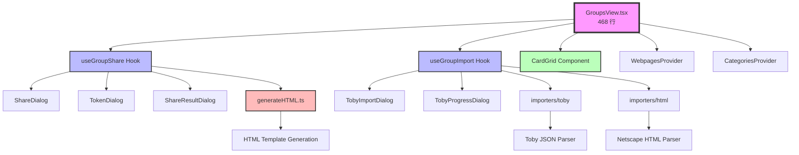
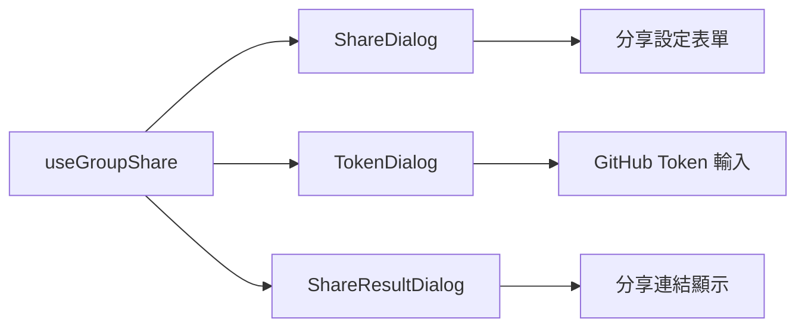
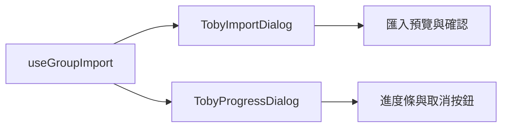

# 組件關係圖

> 本文檔記錄 LinkTrove 主要組件的依賴關係，幫助理解修改影響範圍，防止「改 A 壞 B」

**最後更新：2026-01-08**
**適用版本：重構後架構（GroupsView.tsx 468 行）**

---

## GroupsView 模組架構

### 架構圖



---

## 核心組件依賴關係

### 1. GroupsView.tsx（主組件）

**檔案位置：** `src/app/groups/GroupsView.tsx`
**行數：** 468 行（重構後 -71%）
**職責：** 群組管理主介面，協調各子功能模組

#### 直接依賴

| 組件/模組 | 類型 | 用途 | 破壞影響 |
|----------|------|------|----------|
| useGroupShare | Hook | 分享功能 | 🔴 高：分享功能全部失效 |
| useGroupImport | Hook | 匯入功能 | 🔴 高：匯入功能全部失效 |
| CardGrid | Component | 卡片展示與拖放 | 🔴 高：群組內容無法顯示 |
| WebpagesProvider | Context | 書籤資料管理 | 🔴 高：資料存取全部失效 |
| CategoriesProvider | Context | 分類資料管理 | 🔴 高：分類操作全部失效 |

#### 修改建議

- ✅ **安全修改**：群組 UI 樣式、文案調整
- ⚠️ **謹慎修改**：狀態變數名稱、事件處理函數
- 🔴 **危險修改**：Provider 介面、Hook 返回值結構

---

### 2. useGroupShare Hook（分享功能）

**檔案位置：** `src/app/groups/share/useGroupShare.ts`
**行數：** 239 行
**職責：** 管理群組分享邏輯（GitHub Gist、HTML 匯出）

#### 介面定義

```typescript
interface UseGroupShareOptions {
  categoryId: string;
  items: any[];
  showToast: (msg: string, type: string) => void;
}

interface UseGroupShareReturn {
  shareDialogOpen: boolean;
  shareGroup: GroupItem | null;
  shareTitle: string;
  shareDescription: string;
  tokenDialogOpen: boolean;
  shareResultOpen: boolean;
  shareResultUrl: string;

  setShareDialogOpen: (open: boolean) => void;
  setShareTitle: (title: string) => void;
  setShareDescription: (desc: string) => void;

  openShareDialog: (group: GroupItem) => void;
  publishToGist: () => Promise<void>;
  generateShareFile: () => void;
}
```

#### 依賴的組件

| 組件 | 用途 | 影響 |
|------|------|------|
| ShareDialog | 分享設定介面 | 🟡 中：對話框無法開啟 |
| TokenDialog | GitHub Token 設定 | 🟡 中：首次分享失敗 |
| ShareResultDialog | 分享結果顯示 | 🟢 低：無法顯示結果（功能仍可用）|
| generateHTML.ts | HTML 生成邏輯 | 🔴 高：無法生成分享內容 |

#### 修改建議

- ✅ **安全修改**：對話框樣式、預設標題/描述
- ⚠️ **謹慎修改**：GitHub API 請求參數、Token 儲存邏輯
- 🔴 **危險修改**：Hook 介面（options/return）、publishToGist 函數簽名

---

### 3. useGroupImport Hook（匯入功能）

**檔案位置：** `src/app/groups/import/useGroupImport.ts`
**行數：** 153 行
**職責：** 管理 Toby JSON 與 HTML 書籤匯入

#### 介面定義

```typescript
interface UseGroupImportOptions {
  categoryId: string;
  groups: any[];
  showToast: (msg: string, type: string) => void;
  reloadWebpages: () => Promise<void>;
}

interface UseGroupImportReturn {
  tobyOpenFor: string | null;
  tobyFile: File | null;
  tobyPreview: any | null;
  tobyProgress: TobyProgress | null;

  handleHtmlImport: (groupId: string, file: File) => Promise<void>;
  handleTobyFileSelect: (groupId: string, file: File) => Promise<void>;
  executeTobyImport: (groupId: string, mode: string) => Promise<void>;
  cancelTobyImport: () => void;
  abortTobyImport: () => void;
}
```

#### 依賴的模組

| 模組 | 用途 | 影響 |
|------|------|------|
| TobyImportDialog | 匯入確認介面 | 🟡 中：無法預覽匯入內容 |
| TobyProgressDialog | 進度顯示 | 🟢 低：無法顯示進度（背景仍執行）|
| importers/toby | Toby JSON 解析 | 🔴 高：無法解析 Toby 檔案 |
| importers/html | HTML 書籤解析 | 🔴 高：無法解析 HTML 書籤 |

#### 修改建議

- ✅ **安全修改**：進度顯示樣式、匯入確認對話框文案
- ⚠️ **謹慎修改**：檔案讀取邏輯、AbortController 使用
- 🔴 **危險修改**：Hook 介面、匯入模式參數、importers 呼叫方式

---

### 4. generateHTML.ts（HTML 生成）

**檔案位置：** `src/app/groups/share/generateHTML.ts`
**行數：** ~800 行
**職責：** 生成可分享的獨立 HTML 書籤頁面

#### 函數簽名

```typescript
export function generateBooklistHTML(
  group: any,
  items: any[],
  templates: any[],
  customTitle?: string,
  customDescription?: string
): string
```

#### 使用場景

1. **GitHub Gist 分享** - useGroupShare.publishToGist()
2. **下載 HTML 檔案** - useGroupShare.generateShareFile()

#### 修改建議

- ✅ **安全修改**：HTML 樣式、模板佈局
- ⚠️ **謹慎修改**：書籤元資料渲染邏輯
- 🔴 **危險修改**：函數參數、返回值格式

---

## Sidebar 組件依賴關係

### 1. OrganizationNav.tsx（組織導覽/管理）

**檔案位置：** `src/app/sidebar/OrganizationNav.tsx`  
**職責：** 組織切換、建立、管理（重新命名/顏色/刪除）與刪除確認

#### 直接依賴

| 組件/模組 | 類型 | 用途 | 破壞影響 |
|----------|------|------|----------|
| useOrganizations | Context | 組織資料存取與操作 | 🔴 高：管理/刪除失效 |
| ContextMenu | Component | 右鍵操作選單 | 🟡 中：刪除入口失效 |
| useFeedback | Hook | Toast 提示 | 🟡 中：錯誤提示缺失 |

#### 修改建議

- ✅ **安全修改**：按鈕樣式、對話框文案
- ⚠️ **謹慎修改**：刪除流程與最小數量保護
- 🔴 **危險修改**：Provider 介面、刪除/更新動作簽名

---

## 對話框組件依賴圖

### 分享對話框模組



### 匯入對話框模組



---

## 資料流向分析

### 分享功能流程

```
用戶點擊分享按鈕
    ↓
GroupsView.openShareDialog(group)
    ↓
useGroupShare.setShareGroup(group)
    ↓
ShareDialog 顯示
    ↓
用戶填寫標題/描述 → publishToGist()
    ↓
generateHTML.generateBooklistHTML()
    ↓
呼叫 GitHub Gist API
    ↓
ShareResultDialog 顯示結果
```

### 匯入功能流程

```
用戶選擇檔案
    ↓
useGroupImport.handleTobyFileSelect(file)
    ↓
解析 JSON → 顯示預覽
    ↓
TobyImportDialog 確認
    ↓
executeTobyImport(mode)
    ↓
importers/toby.importTobyJsonIntoGroup()
    ↓
reloadWebpages() → 更新 UI
```

---

## 修改影響評估表

| 修改類型 | 影響範圍 | 風險等級 | 建議操作 |
|---------|---------|---------|---------|
| 對話框樣式 | 單一組件 | 🟢 低 | 直接修改 |
| Hook 內部狀態 | Hook 內部 | 🟡 中 | 確保返回值不變 |
| Hook 介面 | GroupsView | 🔴 高 | 全面測試 |
| generateHTML 參數 | useGroupShare | 🔴 高 | 檢查所有呼叫處 |
| importers 函數 | useGroupImport | 🔴 高 | 測試所有匯入場景 |
| Provider 介面 | 所有消費者 | 🔴 極高 | 避免修改 |

---

## 測試建議

### 修改後必須測試

1. **分享功能**
   - [ ] 開啟分享對話框
   - [ ] 發布到 GitHub Gist（需 Token）
   - [ ] 下載 HTML 檔案
   - [ ] GitHub Token 首次設定流程

2. **匯入功能**
   - [ ] 匯入 Toby JSON（v3/v4）
   - [ ] 匯入 HTML 書籤
   - [ ] 進度顯示與取消操作

3. **群組管理**
   - [ ] 建立/刪除/重新命名群組
   - [ ] 卡片拖放排序
   - [ ] 跨群組移動卡片

---

## 相關文檔

- [重構總結](../meta/REFACTORING_SUMMARY.md) - 完整重構歷程
- [資料格式](../specs/data-format.md) - JSON 結構定義
- [分享功能原始碼](../../src/app/groups/share/) - 分享模組
- [匯入功能原始碼](../../src/app/groups/import/) - 匯入模組

---

**修改原則：先看圖、後動手、多測試！**
