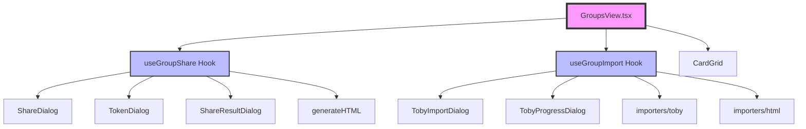

# LinkTrove 文檔架構計畫

> 目標：建立清晰的文檔索引系統，避免 CLAUDE.md 過於肥大，確保未來修改不會改 A 壞 B

---

## 🎯 **設計原則**

1. **分層文檔**：CLAUDE.md 作為入口，詳細內容分散到專門文檔
2. **索引導向**：每個文檔都有明確的索引和交叉引用
3. **組件關係圖**：清楚記錄組件依賴關係
4. **持續更新**：重大變更後更新相關文檔

---

## 📁 **建議的文檔架構**

```
docs/
├── 📄 INDEX.md                          核心索引（新建）⭐️
│
├── 📂 architecture/                     架構文檔（新建）
│   ├── overview.md                      系統概覽
│   ├── component-map.md                 組件關係圖 ⭐️
│   ├── data-flow.md                     資料流向
│   └── module-dependencies.md           模組依賴關係 ⭐️
│
├── 📂 features/                         功能文檔
│   ├── groups-management.md             群組管理（含重構後架構）
│   ├── sharing.md                       分享功能
│   ├── importing.md                     匯入功能
│   ├── cloud-sync.google-drive.md       (現有)
│   └── drag-drop-storage-display.md     (現有)
│
├── 📂 specs/                            規格文檔
│   ├── data-format.md                   (現有)
│   └── book-metadata-mapping.md         (現有)
│
├── 📂 development/                      開發指南（新建）
│   ├── getting-started.md               快速開始
│   ├── testing-guide.md                 測試指南
│   ├── commit-conventions.md            提交規範
│   └── ai-tools-integration.md          AI 工具整合（OpenSpec 等）⭐️
│
└── 📂 meta/                             元文檔（新建）
    ├── REFACTORING_SUMMARY.md           (現有)
    └── SESSION_HANDOFF.md               Session 交接文檔 ⭐️
```

---

## 📝 **核心文檔說明**

### **1. docs/INDEX.md**（核心索引）
**用途**：所有文檔的入口，提供快速導航

**內容結構**：
```markdown
# LinkTrove 文檔索引

## 快速導航
- 🚀 [快速開始](development/getting-started.md)
- 🏗️ [系統架構](architecture/overview.md)
- 🧩 [組件關係圖](architecture/component-map.md)
- 📦 [功能列表](features/)

## 按主題瀏覽
### 架構與設計
- [系統概覽](architecture/overview.md)
- [組件依賴關係](architecture/module-dependencies.md)
- [資料流向](architecture/data-flow.md)

### 功能文檔
- [群組管理](features/groups-management.md)
- [分享功能](features/sharing.md)
- [匯入功能](features/importing.md)
...
```

### **2. architecture/component-map.md**（組件關係圖）⭐️
**用途**：防止改 A 壞 B

**內容結構**：
```markdown
# 組件關係圖

## GroupsView 模組架構



## 依賴關係說明

### GroupsView.tsx 直接依賴
| 組件/模組 | 類型 | 用途 | 破壞影響 |
|----------|------|------|---------|
| useGroupShare | Hook | 分享功能 | 🔴 高：分享功能全部失效 |
| useGroupImport | Hook | 匯入功能 | 🔴 高：匯入功能全部失效 |
| ShareDialog 等 | 組件 | UI 顯示 | 🟡 中：對話框無法顯示 |

### 修改建議
- ✅ **安全修改**：對話框組件的樣式和文案
- ⚠️ **謹慎修改**：Hook 的 props 介面
- 🔴 **危險修改**：Hook 的返回值結構、generateHTML 參數
```

### **3. docs/meta/SESSION_HANDOFF.md**（Session 交接）⭐️
**用途**：解決 session 斷開後的連續性問題

**內容結構**：
```markdown
# Session 交接文檔

> 最後更新：YYYY-MM-DD HH:mm
> 更新者：Claude Sonnet 4.5

## 📍 當前狀態

### 最近完成的工作
1. GroupsView.tsx 重構（-71% 行數）
2. 專案結構清理（刪除 .kiro/ 等）
3. 文檔架構設計

### 程式碼狀態
- 以 `git status` / `git log` / 最新建置結果為準

### 待辦事項
- [x] 安裝並配置 OpenSpec
- [x] 建立文檔架構
- [x] 更新 CLAUDE.md

## 🎯 下次 Session 要做的事

### 優先級 P0（已完成）
1. ✅ **安裝 OpenSpec**
2. ✅ **建立文檔架構**

### 優先級 P1（已完成）
- ✅ 更新 CLAUDE.md（精簡化）
- ✅ 撰寫組件關係文檔

## 📚 上下文參考

### 重要決策記錄
- 保留 AGENTS.md（用戶要求）
- 暫不規劃 .claude/skills/ 目錄
- docs/ 分類架構已設計（見 DOCUMENTATION_PLAN.md）

### 關鍵檔案位置
- 重構總結：`docs/REFACTORING_SUMMARY.md`
- 文檔計畫：`docs/DOCUMENTATION_PLAN.md`
- 組件架構：`src/app/groups/` (share/, import/)
```

---

## 🔧 **CLAUDE.md 精簡方案**

### **現況**
- 已精簡為索引導向，細節分散到 `docs/`

### **精簡策略**
```markdown
# CLAUDE.md（精簡版）

## 專案概述
（簡短說明，2-3 段）

## 快速開始
（開發命令、建置指令）

## 📚 完整文檔索引
👉 **主索引：[docs/INDEX.md](docs/INDEX.md)**

### 常用文檔
- 🏗️ [系統架構](docs/architecture/overview.md)
- 🧩 [組件關係圖](docs/architecture/component-map.md)
- 📦 [功能列表](docs/features/)
- 🛠️ [開發指南](docs/development/)

### 重要規範
- [提交規範](docs/development/commit-conventions.md)
- [測試指南](docs/development/testing-guide.md)
- [AI 工具整合](docs/development/ai-tools-integration.md)

## 重要提醒
- 修改組件前先查看 [組件關係圖](docs/architecture/component-map.md)
- 重大變更後更新相關文檔
- Session 交接時更新 [SESSION_HANDOFF.md](docs/meta/SESSION_HANDOFF.md)
```

---

## 📦 **OpenSpec 整合計畫**

### **階段 1：準備階段**（本 Session）
✅ 完成文檔架構設計
✅ 創建 SESSION_HANDOFF.md
✅ 撰寫 OpenSpec 安裝指南

### **階段 2：安裝階段**（下次 Session）
1. 閱讀交接文檔
2. 執行 OpenSpec 安裝
3. 驗證安裝
4. 更新文檔

### **階段 3：配置階段**
1. 配置 OpenSpec 規格
2. 整合到開發流程
3. 更新 CLAUDE.md

---

## ✅ **執行步驟**

### **步驟 1：創建基礎架構**（本 Session）
```bash
# 創建目錄結構
mkdir -p docs/architecture
mkdir -p docs/features
mkdir -p docs/specs
mkdir -p docs/development
mkdir -p docs/meta

# 移動現有文檔
mv docs/cloud-sync.google-drive.md docs/features/
mv docs/drag-drop-storage-display.md docs/features/
mv docs/data-format.md docs/specs/
mv docs/book-metadata-mapping.md docs/specs/
mv docs/REFACTORING_SUMMARY.md docs/meta/
```

### **步驟 2：創建核心文檔**
- [ ] docs/INDEX.md
- [ ] docs/architecture/component-map.md
- [ ] docs/meta/SESSION_HANDOFF.md
- [ ] docs/development/openspec-installation.md

### **步驟 3：更新 CLAUDE.md**
- [ ] 精簡內容
- [ ] 添加索引連結

### **步驟 4：Git 提交**
```bash
git add docs/
git commit -m "docs: 建立文檔架構系統與 Session 交接機制"
```

---

## 🎯 **成功指標**

1. ✅ CLAUDE.md < 150 行
2. ✅ 所有功能都有對應文檔
3. ✅ 組件關係圖清晰完整
4. ✅ 下次 Session 能無縫接續
5. ✅ OpenSpec 安裝指南完整

---

## 📌 **下次 Session 檢查清單**

開始新 Session 時，檢查：
- [ ] 閱讀 `docs/meta/SESSION_HANDOFF.md`
- [ ] 確認待辦事項
- [ ] 檢查 Git 狀態
- [ ] 執行建置測試

---

**此計畫確保文檔系統化、Session 可連續、OpenSpec 順利整合！**
